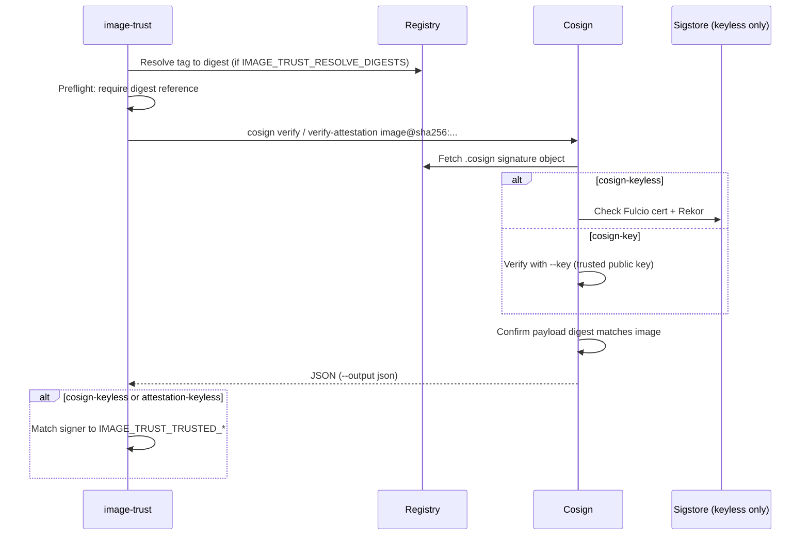

# How Cosign image signatures work

This document explains the Cosign signature format and verification model that **image-trust** relies on. For plugin configuration, see [README.md](../README.md).

Further reading: [Cosign Image Signatures — the protocol format explained](https://medium.com/sigstore/cosign-image-signatures-77bab238a93) (Sigstore / Dan Lorenc).

## The big idea

When you sign a container image with Cosign, you do **not** modify the image itself. Cosign:

1. Computes a **digest** (fingerprint) of the image manifest
2. Signs a small **payload** that includes that digest (plus optional metadata)
3. Stores the signature in the **same OCI registry**, as a separate “signature image”

Think of the image as the document and the `.cosign` object as a linked envelope in the registry that holds the notarized stamp.

```
myimage:v1.0  →  myimage:sha256-<digest>.cosign
```

Cosign uses a fixed naming convention (`cosign triangulate` shows the target). That `.cosign` tag points to a separate registry object that holds one or more signatures.

## What gets signed

An image is not a single on-disk file. Cosign signs the **SHA256 digest of the OCI image manifest** — the JSON that describes layers and metadata. That digest is what you reference as `image@sha256:abc123...`.

Instead of signing only the raw digest, Cosign wraps it in a payload using the [Red Hat Simple Signing](https://www.redhat.com/en/blog/container-image-signing) format. The critical field is:

- **`Critical.Image.Docker-manifest-digest`** — must match the digest of the image being verified (despite the name, this applies to OCI manifests too)

Optional key/value pairs can be attached at sign time (`cosign sign -a key=value`) and filtered at verify time.

## How signatures are stored in the registry

Registries do not natively support “attach a signature to an image.” Cosign works around this:

| Design choice | Why |
|---------------|-----|
| Separate `.cosign` image | Avoids mutating the original image manifest |
| Sign manifest digest, not image blobs | Manifest is the canonical identity of an image |
| Store signatures as OCI manifest **layers** | Works on most registries without special features |
| Append layers for multiple signers | Several parties can sign the same image |

Each signature is stored as a layer on the signature manifest. The layer annotation key is `dev.sigstore.cosign/signature`; the value is a base64-encoded signature. The signature blob itself lives in registry storage and is referenced by the layer descriptor.

**Limitations of this approach** (inherent to Cosign today):

- **Race conditions** — adding a signature is download → append layer → upload (last write wins)
- **No automatic GC** — orphaned signature blobs are not cleaned up reliably
- **Copying images** — signatures do not automatically move when you copy an image to another registry (configure `IMAGE_TRUST_REGISTRY_MIRRORS` when signatures live on upstream hosts)

image-trust only supports **OCI Cosign signatures stored in the registry** (not Notary v1, GPG, or offline bundles).

## Keyed signing (`cosign-key`)

With keyed signing, you manage long-lived key material yourself.

### Sign

1. `cosign generate-key-pair` creates an **ECDSA P-256** key pair
2. The private key is encrypted on disk (passphrase + scrypt KDF)
3. `cosign sign --key cosign.key <image>` decrypts the private key, signs the payload, and uploads the signature to the `.cosign` object

### Verify

1. Load a **pre-shared public key** (`cosign.pub`, PEM, or KMS URI)
2. Fetch the `.cosign` signature object from the registry
3. Cryptographically verify the signature
4. Confirm the payload’s `Docker-manifest-digest` matches the image digest

Trust comes from **you** trusting that public key ahead of time (`IMAGE_TRUST_PUBLIC_KEY_PATHS`, `IMAGE_TRUST_PUBLIC_KEY_DIR`, or `IMAGE_TRUST_PUBLIC_KEY_REFS`).

For air-gapped or offline verification, use `cosign-key` with `IMAGE_TRUST_IGNORE_TLOG=true` so Rekor is not required.

## Keyless signing (`cosign-keyless`)

Keyless signing uses **ephemeral** keys and Sigstore services to bind a signature to an OIDC identity (for example a GitHub Actions workflow). **Keys are not stored in the registry.**

### Sign

1. Cosign generates a **short-lived key pair** in memory
2. You authenticate via **OIDC** (browser, GitHub Actions token, etc.)
3. **Fulcio** issues an X.509 certificate: “this public key belongs to identity X” (e.g. `https://github.com/org/repo/.github/workflows/release.yml@refs/heads/main`)
4. The ephemeral **private key** signs the same payload format as keyed signing
5. The **signature and certificate** are uploaded to the `.cosign` object in the registry
6. An entry is recorded in **Rekor** (transparency log)
7. The ephemeral **private key is discarded** — it is never written to the registry or anywhere durable

### What is stored where

| Item | Registry? | Elsewhere? |
|------|-----------|------------|
| Ephemeral **private** key | No | Discarded after signing |
| Ephemeral **public** key | Not as a standalone key file | Embedded in the Fulcio **certificate** bundled with the signature |
| **Signature** | Yes (`.cosign` object) | Also recorded in Rekor |
| **Certificate** (Fulcio) | Yes (bundled with signature) | Rekor entry |
| Long-lived `cosign.key` / `cosign.pub` | N/A for keyless | N/A |

### Verify

Verifiers do **not** fetch a public key from the registry and trust it blindly. They:

1. Pull the signature (and certificate) from the registry’s `.cosign` object
2. Validate the certificate was issued by **Fulcio** and check **Rekor** (unless tlog checks are disabled)
3. Apply **trust policy** on certificate identity — issuer and subject (see below)
4. Confirm the payload digest matches the image being verified

Trust comes from **OIDC identity + Fulcio + Rekor**, not from keys stored in the registry.

Private clusters need outbound access to Sigstore (Fulcio, Rekor, TUF roots) or a self-hosted Sigstore (`FULCIO_URL`, `REKOR_URL`, `SIGSTORE_ROOT_FILE`, or `IMAGE_TRUST_SIGSTORE_ENV_FILE`).

## Verification flow (both modes)

At a high level, verification always checks two things:

1. **Cryptographic validity** — the signature is valid for the payload
2. **Binding** — the payload’s manifest digest matches the image you asked about

Without step 2, you would only know “someone signed something,” not that it is tied to **this specific image**.



## How image-trust uses this

### Pipeline

1. **Discover** images from running workloads (pod `image` / `imageID` via the Kubernetes API; no registry login at this step).
2. **Resolve digests** when `IMAGE_TRUST_RESOLVE_DIGESTS=true` (default): tag-only references are looked up with the registry API (`go-containerregistry`). Failures set `digestResolveError` on the image.
3. **Preflight**: if there is no `image@sha256:…` reference and no digest resolve error, status is `unknown` without calling cosign. If digest lookup failed, status is `verification_error` without calling cosign.
4. **Verify** via `cosign` subprocess with registry auth from docker config (`REGISTRY_*`, `IMAGE_TRUST_REGISTRY_AUTHS`, optional pull secrets).
5. **Allowlists** (`IMAGE_TRUST_*_ALLOWLIST`) suppress findings but do not change reported status.

Sigstore endpoints and trust roots are forwarded to cosign from the plugin process environment (`FULCIO_URL`, `REKOR_URL`, `SIGSTORE_ROOT_FILE`, etc.) and optional `IMAGE_TRUST_SIGSTORE_ENV_FILE` — see `pkg/sigstore/env.go`.

### Verification modes

| Mode | Cosign command | Trust enforced by |
|------|----------------|-----------------|
| `cosign-keyless` | `cosign verify --output json` (no `--key`) | Plugin after cosign succeeds |
| `cosign-key` | `cosign verify --output json --key <ref>` | Cosign (must match a configured public key) |
| `cosign-attestation-keyless` | `cosign verify-attestation --type <t> --output json` | Plugin after cosign succeeds |
| `cosign-attestation-key` | `cosign verify-attestation --type <t> --key <ref>` | Cosign (key + attestation type) |

`IMAGE_TRUST_IGNORE_TLOG=true` adds `--insecure-ignore-tlog` for **keyed** modes only (`cosign-key`, `cosign-attestation-key`).

### Keyless trust policy (plugin-side)

For `cosign-keyless` and `cosign-attestation-keyless`, cosign is invoked with permissive certificate flags (`--certificate-identity-regexp .*`, `--certificate-oidc-issuer-regexp .*`). Cosign checks cryptography, Fulcio, and Rekor; **image-trust** then filters signers from cosign JSON output against:

- `IMAGE_TRUST_TRUSTED_ISSUERS`
- `IMAGE_TRUST_TRUSTED_SUBJECTS`
- `IMAGE_TRUST_TRUSTED_SUBJECT_REGEXPS`

At least one of these must be set when a keyless mode is enabled (`pkg/config/config.go`).

- Multiple issuers or subjects in a list are **OR** within that dimension (regex alternation).
- When **both** issuer and subject matchers are configured, a signer must match **both** (AND) — see `isTrustedSigner` in `pkg/verify/cosign.go`.
- If cosign succeeds but no signer matches → `signed_untrusted`.
- If cosign succeeds with no parseable signer identity → `verification_error`.

### Keyed verification

`cosign-key` tries each trusted public key (`IMAGE_TRUST_PUBLIC_KEY_PATHS`, `IMAGE_TRUST_PUBLIC_KEY_DIR`, `IMAGE_TRUST_PUBLIC_KEY_REFS`) until one verifies. Any matching key → `verified`. No separate issuer/subject policy for keyed signature mode (use `IMAGE_TRUST_SIGNER_ALLOWLIST` only to suppress findings).

Attestation keyed mode tries each **(key, attestation type)** pair from `IMAGE_TRUST_ATTESTATION_TYPES` until one succeeds.

### Multiple modes

With several modes in `IMAGE_TRUST_MODES`:

- `IMAGE_TRUST_MODE_POLICY=any` (default): first mode in `IMAGE_TRUST_MODES` list order that returns `verified` wins.
- `IMAGE_TRUST_MODE_POLICY=all`: every configured mode must return `verified`; the first failure is returned. On success, metadata is merged across verifiers (for example `attestationType` from attestation modes and signer from signature modes). With both `cosign-keyless` and `cosign-key` enabled, `all` requires both to pass.

When merging failed attempts, priority is: `signed_untrusted` → `unsigned` → `verification_error` → `unknown` (`pkg/verify/composite.go`).

### Report statuses

| Status | When image-trust sets it |
|--------|--------------------------|
| `verified` | Cosign verification succeeded and trust policy passed (keyless: signer match; keyed: trusted `--key`) |
| `unsigned` | Cosign reports no matching signature/attestation (`pkg/verify/classify.go`) |
| `signed_untrusted` | Keyless: signature valid but signer outside `IMAGE_TRUST_TRUSTED_*`; or cosign stderr suggests identity/issuer mismatch |
| `verification_error` | Registry/auth/network/cosign failure; digest lookup failed (`digestResolveError`); missing cosign binary; parse errors |
| `unknown` | No immutable digest reference and digest resolution was not attempted or not applicable |

Registry credentials are required for **verification** (reading `.cosign` objects and optional digest resolution), even though discovery uses only the Kubernetes API.

## Attestations

Attestation modes (`cosign-attestation-keyless`, `cosign-attestation-key`) use the same registry storage model but call `cosign verify-attestation` instead of `cosign verify`. Configure comma-separated predicate types with `IMAGE_TRUST_ATTESTATION_TYPES` (for example `slsaprovenance1`, `spdxjson`, `cyclonedx`).

When `IMAGE_TRUST_ATTESTATIONS_ENABLED` is true or types are configured, matching attestation modes are appended for each enabled signature mode (`cosign-keyless` → `cosign-attestation-keyless`, `cosign-key` → `cosign-attestation-key`). Public keys or OIDC trust policy alone do **not** enable an attestation mode unless the corresponding signature mode is also enabled.

The plugin tries each configured predicate type until one verifies (**OR** semantics). Requiring multiple predicate types (for example both SLSA provenance and SPDX SBOM) is not supported today.

Verification checks predicate **type** and signer trust only — not attestation payload fields (SLSA builder identity, minimum SLSA level, package lists, etc.). Use admission policy engines (Rego, CUE, Kyverno) if you need content-level attestation policy.

Attestation modes require `IMAGE_TRUST_ATTESTATION_TYPES` at startup; keyless attestation modes also require issuer/subject trust policy like `cosign-keyless`.

## References

- [Cosign Image Signatures — protocol format](https://medium.com/sigstore/cosign-image-signatures-77bab238a93)
- [Sigstore documentation](https://docs.sigstore.dev/)
- [Cosign verify documentation](https://docs.sigstore.dev/signing/verify/)
